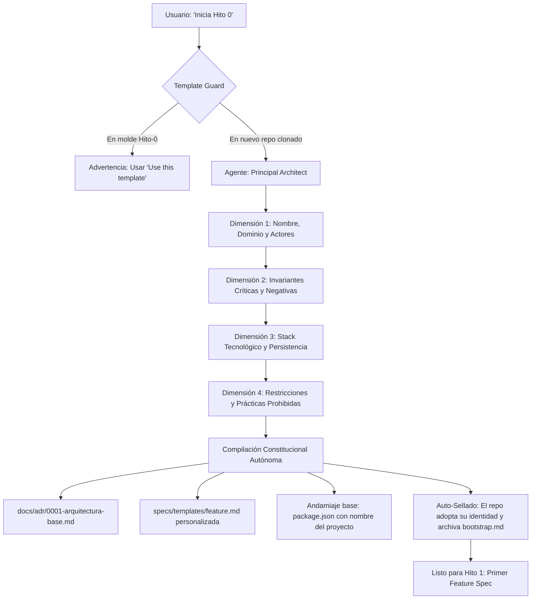

# Blueprint Agnóstico — Hito 0 (Template Repo)

> **Semilla de Gobernanza Agéntica Agnóstica** diseñada para el desarrollo de software de alta fidelidad con agentes autónomos (Google Antigravity, Claude Code, Cursor, Roo Code, etc.). Basado en **Spec-Driven Development (SDD)**, **Architecture Decision Records (ADR)**, **Agentic TDD** y **Quality Gates Deterministas**.

---

## 💡 ¿Por qué existe este Blueprint?

En el desarrollo de software asistido por IA, la premisa fundamental es:
> *Un agente sin especificaciones formales alucina, improvisa dependencias y degrada la arquitectura. El humano diseña contratos, restricciones e invariantes; el agente implementa y valida contra esas restricciones.*

Este repositorio sirve como **molde o plantilla inicial (Template Repo)** para cualquier nuevo proyecto. En lugar de configurar manualmente linters, tipados, carpetas y reglas cada vez, este repositorio empaqueta el **Hito 0 (Bootstrap Constitucional)**: una entrevista técnica interactiva guiada por el agente para compilar automáticamente la arquitectura, las invariantes y los mecanismos de control del nuevo software.

---

## 🚀 Cómo iniciar un nuevo proyecto (Flujo en 3 Pasos)

### 1. Crear tu propio repositorio desde la Plantilla
- En GitHub, entra a [`Zer0x25/Hito-0`](https://github.com/Zer0x25/Hito-0) y pulsa el botón verde **"Use this template"** $\rightarrow$ **"Create a new repository"**.
- Asigna el nombre de tu nuevo proyecto (ej: `portal-control-v3`, `sistema-inventarios`, `mi-app`).
- Clónalo en tu máquina local.

### 2. Abrir en tu Entorno Agéntico
- Abre la carpeta del nuevo proyecto en **Antigravity IDE** (o tu arnés agéntico preferido).

### 3. Ejecutar el Protocolo de Hito 0
En la consola de chat del agente, simplemente escribe:
```text
Inicia Hito 0
```
*(O de forma explícita: `"Ejecuta el protocolo en .agents/bootstrap.md"`)*.

---

## 🎙️ ¿Qué sucede durante el Hito 0?

El agente asumirá el rol de **Principal Software Architect** y te guiará en una entrevista breve (máximo 2 preguntas por turno en lenguaje claro) cubriendo 4 dimensiones:



### 🔒 Protocolo de Auto-Sellado y Transición No Destructiva
Cuando el Hito 0 concluye en tu nuevo repositorio:
1. **La implementación base no se pisa:** `src/core/errors.ts` y `docs/adr/0000-adopcion-gobernanza-agentica.md` permanecen como cimientos inmutables.
2. **Identidad propia:** `package.json` y `STATE.md` adoptan el nombre real de tu software y pasan a **Hito 1 (En Desarrollo)**.
3. **Reducción de ruido de contexto:** `.agents/bootstrap.md` se auto-archiva a `.agents/bootstrap.md.done` para que los agentes futuros se enfoquen al 100% en las features del negocio.
4. **Transformación de Documentación:** `README.md` se actualiza con el título y propósito de tu nuevo proyecto.

---

## 📁 Estructura del Repositorio Semilla

```text
├── .agents/
│   └── bootstrap.md            # Motor del Hito 0: Protocolo de entrevista y Template Guard
├── .github/
│   └── workflows/
│       └── verify.yml          # CI/CD Determinista en GitHub Actions
├── .githooks/
│   └── pre-commit              # Git hook local: bloquea commits si verify.sh falla
├── docs/
│   └── adr/
│       ├── .gitkeep
│       ├── 0000-adopcion-gobernanza-agentica.md  # Constitución Génesis
│       └── 0000-template.md    # Plantilla estándar para futuros ADRs
├── specs/
│   ├── .gitkeep
│   └── templates/
│       ├── .gitkeep
│       └── feature.template.md # Plantilla base de Spec-Driven Development (SDD)
├── src/
│   ├── core/
│   │   ├── .gitkeep
│   │   └── errors.ts           # Clase base universal DomainError y type guards
│   └── modules/                # Dominios verticales cerrados
├── tests/
│   └── modules/                # Pruebas unitarias/integración por módulo
├── scripts/
│   ├── .gitkeep
│   └── verify.sh               # Script de Quality Gate determinista (código 0 o 1)
├── .env.example                # Variables de entorno documentadas (tipadas vía Zod)
├── .gitignore                  # Exclusiones estándar para desarrollo limpio
├── AGENTS.md                   # Reglas maestras de gobernanza universales
├── STATE.md                    # Tablero de control y memoria de estado persistente
└── README.md                   # Este documento
```

---

## 🛡️ Pilares de Excelencia Agéntica

1. **Template Guard:** Salvaguarda que protege el molde maestro `Hito-0` contra sobreescritura accidental.
2. **Invariantes Negativas Explícitas:** Las especificaciones definen formalmente qué operaciones o estados son *intolerables* (ej. saldo negativo, texto plano, mutaciones no atómicas).
3. **Errores de Dominio Tipados:** Clase base `DomainError` en `src/core/errors.ts`; prohibido `throw new Error()` genérico.
4. **Manejo Seguro de Entorno:** Prohibido acceder a `process.env` fuera de `src/core/config.ts`, donde Zod valida las variables en el arranque.
5. **Conventional Commits:** Todo commit de agente sigue el estándar (`feat(modulo): ...`, `test(modulo): ...`, `fix(modulo): ...`).
6. **Quality Gate Local y en la Nube:** Barrera inmutable ejecutada por `./scripts/verify.sh`, validada por el pre-commit hook y por GitHub Actions en cada PR.

---

## 🔄 Flujo de Trabajo en el Día a Día (Hito 1 en adelante)

1. **Creación del Requerimiento:**
   Copias `specs/templates/feature.md` a `specs/feat-001-<modulo>.md` y completas contratos, invariantes y criterios.
2. **Entrega al Agente:**
   > *"Implementa la especificación en `specs/feat-001-<modulo>.md`"*
3. **Ciclo Agentic TDD:**
   - El agente escribe los tests unitarios primero (**Fase Roja**).
   - Implementa la solución mínima en los archivos autorizados (**Fase Verde**).
   - Ejecuta `./scripts/verify.sh` hasta obtener **código de salida 0**.
   - Registra el avance en [`STATE.md`](file://STATE.md).
